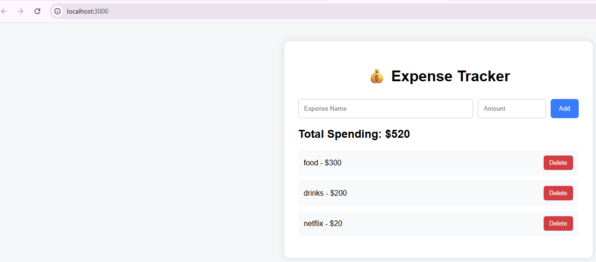

# Expense Tracker App

## Overview
A modern expense tracking web application built with React and JavaScript.

## Features
- Add expenses
- Delete expenses
- Calculate total spending
- Persistent data using localStorage
- Responsive modern UI

## Technologies Used
- React
- JavaScript
- HTML
- CSS
- localStorage

## Project Preview



## How to Run

1. Clone the repository

```bash
git clone https://github.com/pragyapaliwalsharma-hue/expense-tracker-app.git
```

2. Open the project folder

3. Install dependencies

```bash
npm install
```

4. Start the application

```bash
npm start
```

5. Open browser at:

```txt
http://localhost:3000
```

## Future Improvements
- Expense categories
- Charts and analytics
- Dark mode
- Backend database integration
